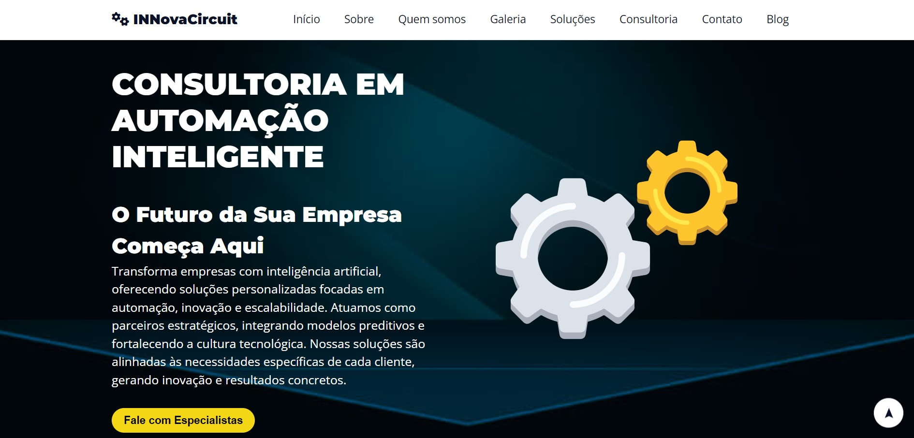
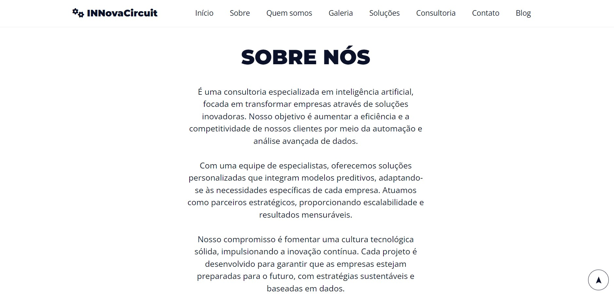

# Landing Page

Este é um projeto de landing page criado para demonstrar soluções de consultoria em inteligência artificial. A página inclui seções sobre a empresa, seus serviços, galeria de fotos, planos de consultoria e contato.

## Estrutura do Projeto

O projeto é organizado da seguinte forma:

- `index.html`: Arquivo principal HTML que contém a estrutura da página.
- `css/`: Pasta contendo os arquivos de estilo CSS.
- `images/`: Pasta contendo as imagens utilizadas no projeto.

## Tecnologias Utilizadas

- **HTML5**: Estrutura básica da página.
- **CSS3**: Estilização da página, incluindo o uso de Flexbox e Grid.
- **Google Fonts**: Fontes personalizadas para melhorar a aparência do texto.

## Funcionalidades

- **Menu Responsivo**: Um menu lateral que se ajusta a diferentes tamanhos de tela.
- **Seções Dinâmicas**: Inclui seções para introdução, sobre, galeria, soluções, planos, contato e blog.
- **Formulário de Contato**: Permite que os visitantes enviem mensagens diretamente.

## Como Executar o Projeto

1. Clone este repositório:
  
       git clone https://github.com/seu-usuario/nome-do-repositorio.git

2. Navegue até o diretório do projeto:
   
       cd nome-do-repositorio

4. Abra o arquivo index.html em um navegador para visualizar a landing page.

## Contato

Para mais informações, você pode me encontrar no LinkedIn: [Suelen Maria Kuminck](https://www.linkedin.com/in/suelen-maria-kuminck/).

📷 Tela de Login

Aqui está uma captura de telas de interface do projeto:

## Início

## Sobre

